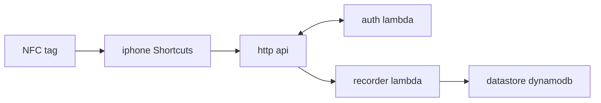
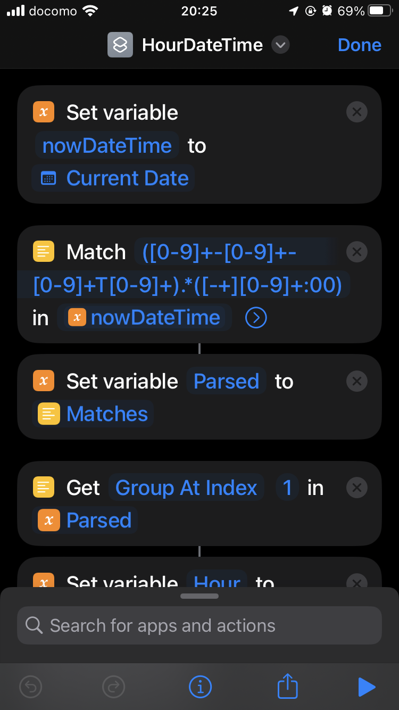
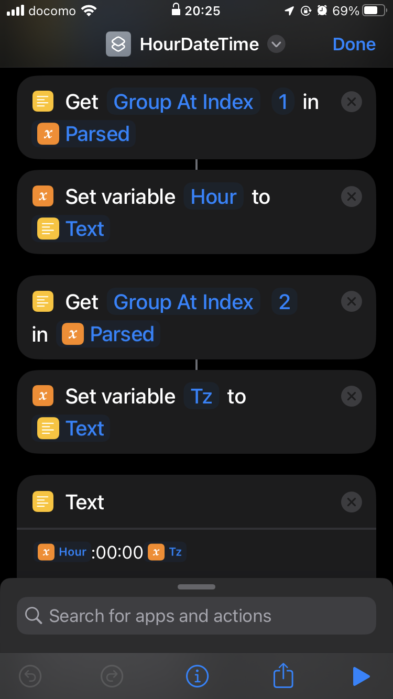
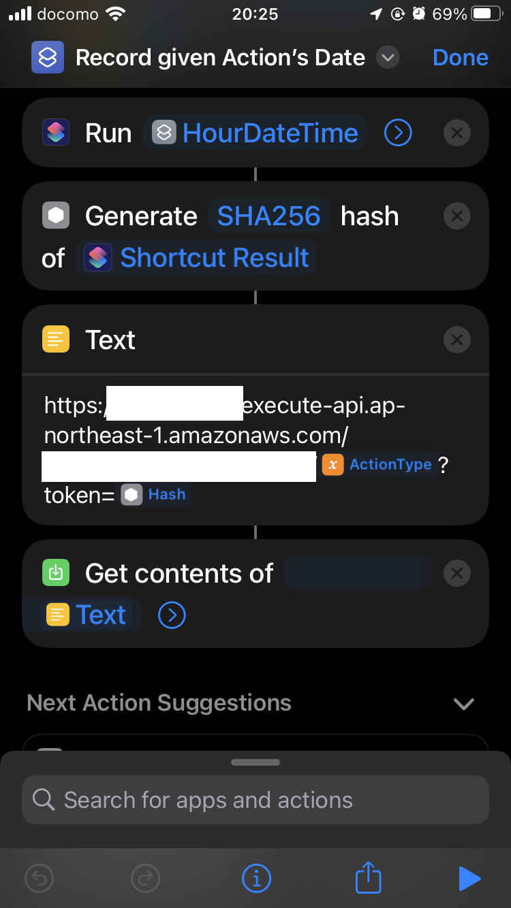

# clean house
## これは何？
家の清掃点検表記録部分

家のトイレ等にNFCタグを貼り、iPhoneを近づけるとその日時を時間単位で記録する。
読み取り部分は非公開プロジェクトから切り出せていない。

iOSのShortcutsで複雑なことができないが、トイレに塩基性洗剤をかけた日時に真面目なクライアント認証をするのもさすがにやりすぎと感じたのでトイプロジェクトらしく1時間ごとに変わる秘密？のtokenで認可する。

    date_and_hour = (Japan timezone ISO-8601 datetime).set_minute(0).set_second(0)
    token = hexstring(sha256(salt + date_and_hour))

これはiOSのshortcutsで実現できる。

(公開分にはsaltを入れていない。)

## Setup
infra/initial で terraform apply

github actionでビルド

infra/ で terraform apply

整備不良のため、lambdaバイナリのビルドやアップデートが終わっていない初回にaws lambdaの生成に失敗するかもしれない。

## Local Development

    cargo install cargo-lambda
    cargo lambda 

(この規模のではデプロイしてcloudwatchでも見たほうが早そうだが、)ローカルでも

    tmp_dir=$(mktemp -d -t tmpXXXXXXX)
    cp target/lambda/api_auth/bootstrap ${tmp_dir}
    docker run -it --rm -e DOCKER_LAMBDA_STAY_OPEN=1 -p 9001:9001 -v ${tmp_dir}:/var/task:ro,delegated -e DOCKER_LAMBDA_USE_STDIN=1 -e AWS_LAMBDA_FUNCTION_MEMORY_SIZE=128 -e RUST_LOG=info lambci/lambda:provided main

の後に

    aws lambda invoke --endpoint http://localhost:9001 --no-sign-request --function-name main --payload '{}' output.json

とかで実行できるはず

## Infra
 terraform backendを自分のs3 backendにしている。

 terraform applyは自動化していない。

 lambdaのupdateをgithub actions内で行っている。初回はinfraのAWS lambda自体がないためその部分だけは失敗するはず。
